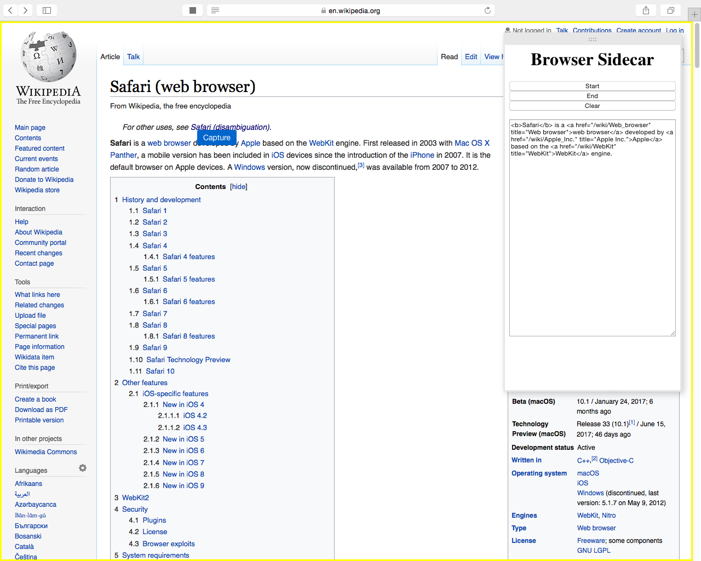

# Browser Sidecar

A cross-platform, cross-browser extension that adds a "sidecar" of content to any webpage you visit, suitable for an Evernote-like web clipper as well as many other uses.

### [Google Chrome](https://en.wikipedia.org/wiki/Google_Chrome) - Windows / OSX / Linux

### [Microsoft Edge](https://en.wikipedia.org/wiki/Microsoft_Edge) - Windows

### [Mozilla Firefox](https://en.wikipedia.org/wiki/Firefox) - Windows / OSX / Linux

### [Opera](https://en.wikipedia.org/wiki/Opera_%28web_browser%29) - Windows / OSX / Linux

### [Apple Safari](https://en.wikipedia.org/wiki/Safari_%28web_browser%29) - Windows / OSX

### [Vivaldi](https://en.wikipedia.org/wiki/Vivaldi_%28web_browser%29) - Windows / OSX / Linux

### [Yandex Browser](https://en.wikipedia.org/wiki/Yandex_Browser) - Windows / OSX

### Install / Build Steps

1. Run `gulp-install.bat` to setup node.js on your computer.
2. Run `gulp-run.bat` to build the extension with the following parameters:
    * %1 - Path to gulpfile.js, i.e. `browser-extension\gulpfile.js`
    * %2 - Step in gulpfile.js to execute, i.e. `default` for a full build or `chrome` for just a Google Chrome build
    * %3 - Environment to target, i.e. `Local`, `Development`, `QA`, `Stage` or `Production`
3. Use output generated in the `browser-extension\config\{browser}` and `browser-extension\dist\{browser}` directories to install.
    * The `config` directory tree contains un-packaged extensions.
    * The `dist` directory tree contains packaged extensions as well as packaged store assets (change logs, screenshots).
    * If you open the `index.html` document in the root directory you are redirected to a simple landing page with shortcuts to these directories.
4. Profit!